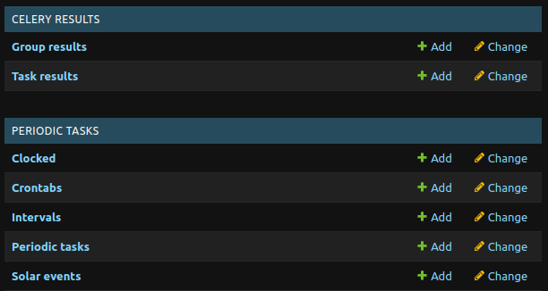
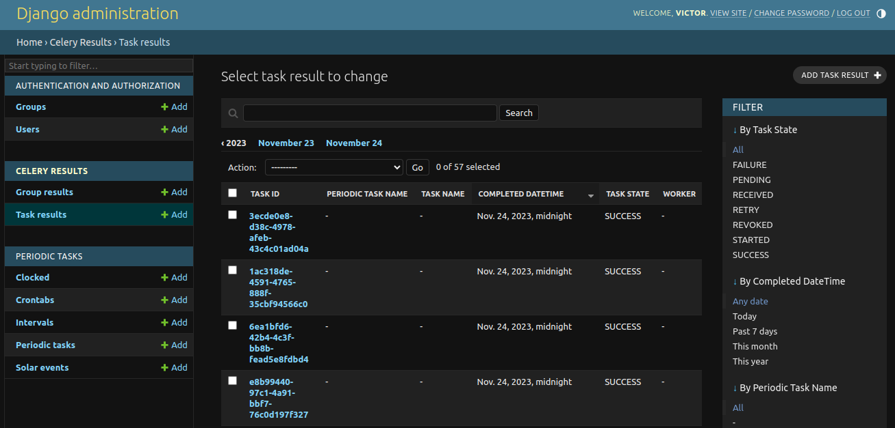
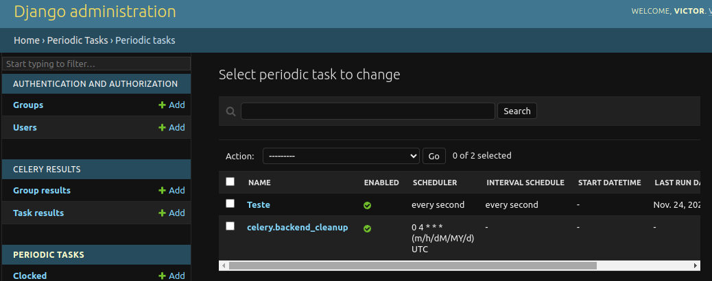

# django-celery-using

### [Task Results](https://docs.celeryq.dev/en/stable/django/first-steps-with-django.html#django-celery-results-using-the-django-orm-cache-as-a-result-backend)

### [Periodic Tasks](https://docs.celeryq.dev/en/stable/django/first-steps-with-django.html#django-celery-beat-database-backed-periodic-tasks-with-admin-interface)

## Setup Instructions

Create a Virtual Environment:

`python -m venv .venv`

Activate the Virtual Environment:

`source .venv/bin/activate
`

Install dependencies:

`pip install -r requirements.txt
`

Copy Environment Variables:

`cp contrib/env-sample .env
`

Run Database Migrations:

`python manage.py migrate
`

Run Celery Worker:

`celery -A projeto worker -l INFO
`

Run Celery Worker with auto reload:

`watchfiles --filter python 'celery -A projeto worker -l INFO'
`

Run Celery Beat for periodic tasks:

`celery -A projeto beat -l INFO --scheduler django_celery_beat.schedulers:DatabaseScheduler
`
